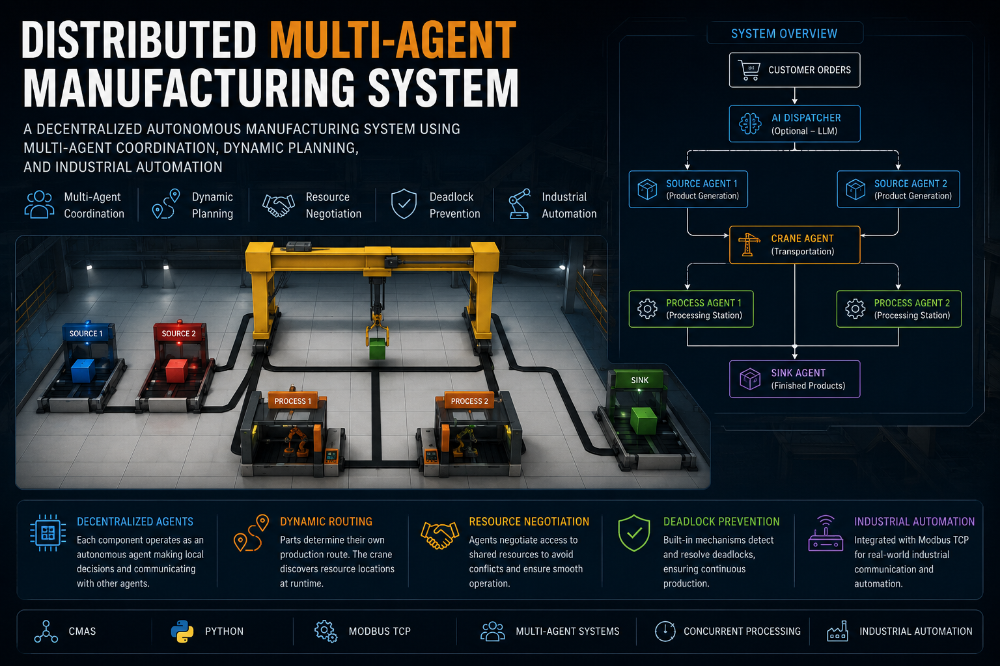
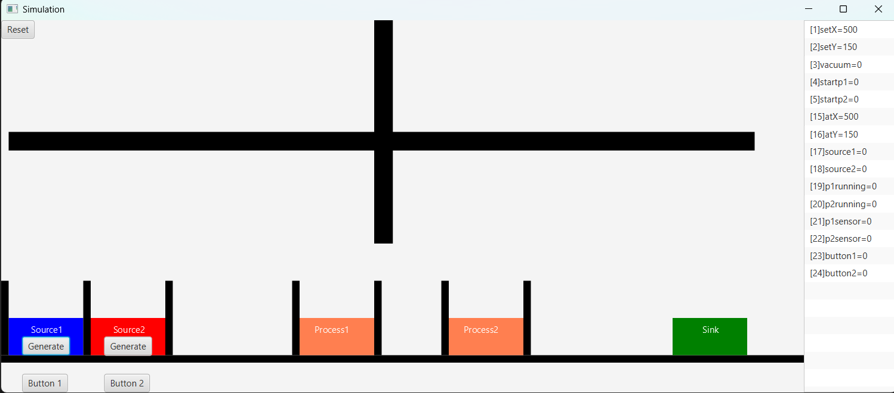
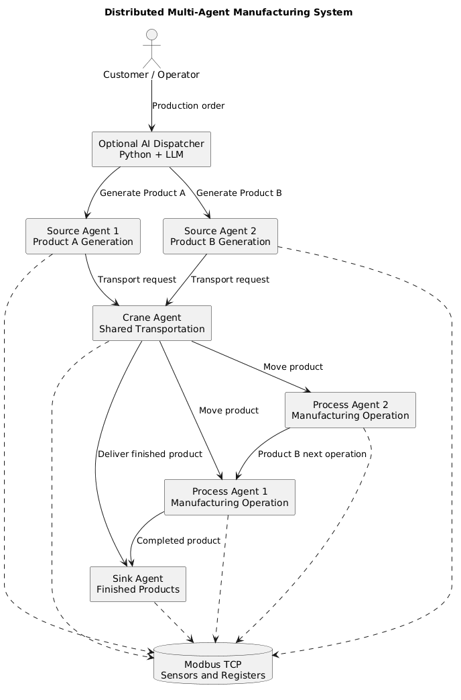
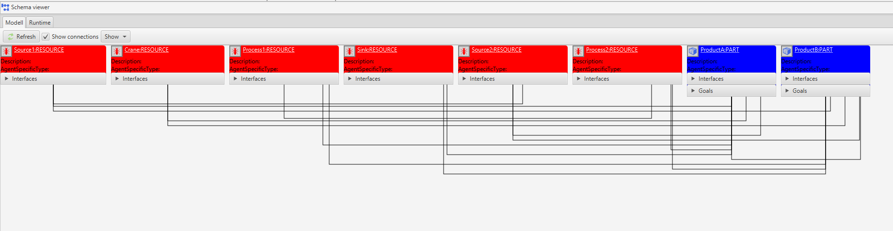
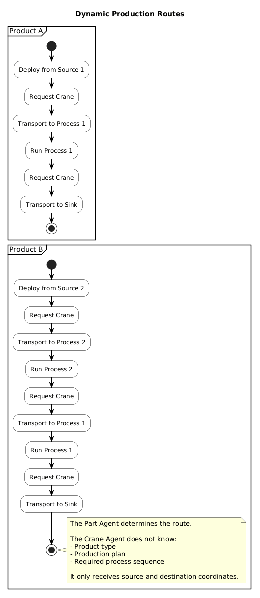
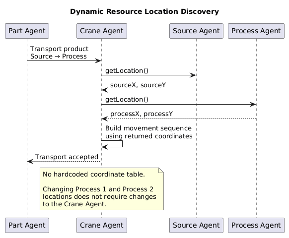
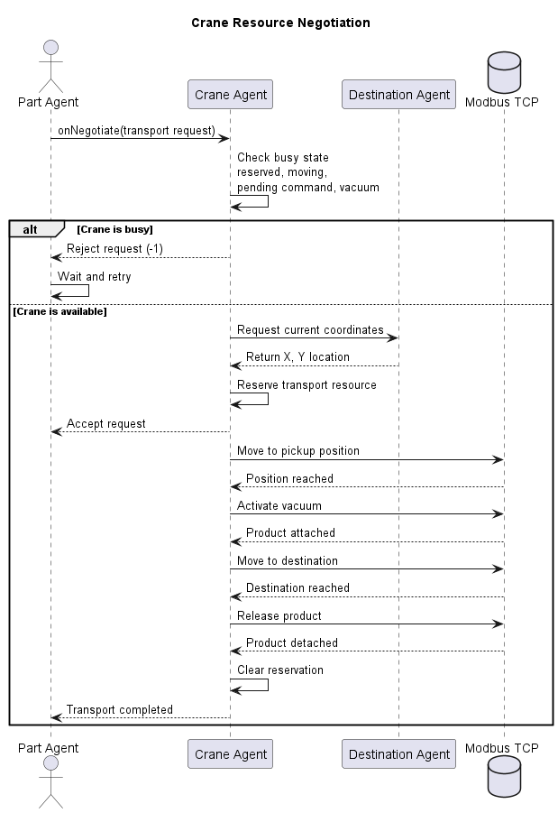
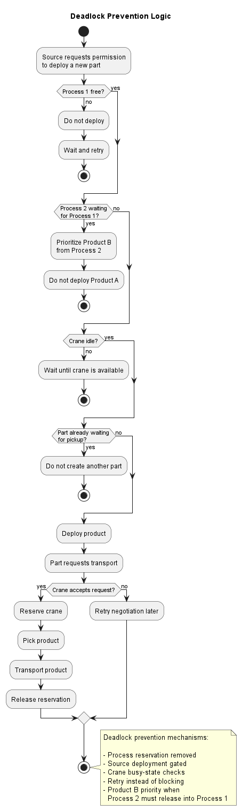
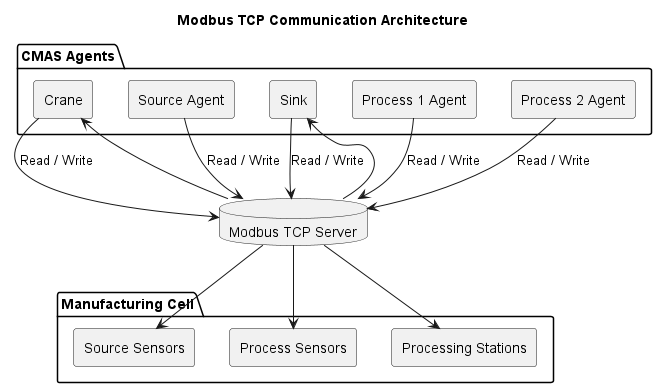
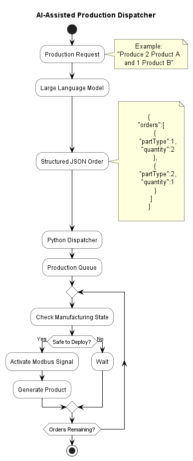

# 🏭 Distributed Multi-Agent Manufacturing System

> A decentralized manufacturing control system using autonomous agents, dynamic resource negotiation, runtime location discovery, deadlock prevention, and Modbus TCP communication.

<p align="center">
  
</p>

<p align="center">
  
  
  
  
  
</p>

---

## Table of Contents

* [Overview](#overview)
* [Engineering Problem](#engineering-problem)
* [Project Objectives](#project-objectives)
* [Project Highlights](#project-highlights)
* [Manufacturing Cell](#manufacturing-cell)
* [Factory Architecture](#factory-architecture)
* [Multi-Agent Architecture](#multi-agent-architecture)
* [Agent Responsibilities](#agent-responsibilities)
* [Product Routes](#product-routes)
* [Dynamic Location Discovery](#dynamic-location-discovery)
* [Resource Negotiation](#resource-negotiation)
* [Deadlock Prevention](#deadlock-prevention)
* [Industrial Communication](#industrial-communication)
* [Optional AI Dispatcher](#optional-ai-dispatcher)
* [System Behaviour](#system-behaviour)
* [Validation Scenarios](#validation-scenarios)
* [Engineering Challenges](#engineering-challenges)
* [Key Design Decisions](#key-design-decisions)
* [Results](#results)
* [Technologies](#technologies)
* [Repository Structure](#repository-structure)
* [Running the System](#running-the-system)
* [Limitations](#limitations)
* [Future Work](#future-work)
* [Lessons Learned](#lessons-learned)
* [Author](#author)
* [Academic Context](#academic-context)

---

# Overview

Modern manufacturing systems consist of several machines operating concurrently while competing for shared resources such as transport systems, processing stations, buffers, sensors, and storage locations.

A centralized controller can coordinate these components, but centralized architectures often become difficult to extend, tightly coupled, and vulnerable to bottlenecks. A small change to one machine may require modifications across the entire control system.

This project explores a decentralized alternative.

Each manufacturing component is represented as an autonomous software agent responsible for its own state, capabilities, decisions, and communication. The agents collaborate to manufacture multiple product types while sharing a crane and processing stations.

The system demonstrates:

* Decentralized decision-making
* Autonomous resource negotiation
* Dynamic production routing
* Runtime location discovery
* Concurrent manufacturing
* Deadlock prevention
* Industrial communication through Modbus TCP
* Optional AI-assisted production-order generation

The result is a modular manufacturing control system in which machines cooperate without depending on a single centralized scheduler.

---

# Engineering Problem

Manufacturing cells often contain shared resources that cannot be used by several products simultaneously.

Examples include:

* A single transport crane
* Processing stations with limited capacity
* Product sources
* Buffers
* Sensors
* A final sink or storage station

When several products are introduced into the system concurrently, poor coordination can cause:

* Deadlocks
* Resource starvation
* Conflicting transport commands
* Collisions
* Blocked processing stations
* Unnecessary machine idle time
* Reduced throughput

The engineering challenge was therefore to design a system that could:

1. Manufacture several product types with different production routes.
2. Allow several products to exist in the system concurrently.
3. Share a single crane safely.
4. Prevent two products from being picked up simultaneously.
5. Avoid circular waiting conditions.
6. Adapt when machine coordinates change.
7. Keep the crane independent of product-specific logic.

---

# Project Objectives

The system was designed to satisfy three main levels of functionality.

## Product A Workflow

The system must manufacture Product A using the route:

```text
Source 1
   ↓
Process 1
   ↓
Sink
```

The system must support multiple Product A parts without collisions, deadlocks, or starvation.

## Product B Workflow

The system must manufacture Product B using the route:

```text
Source 2
   ↓
Process 2
   ↓
Process 1
   ↓
Sink
```

Product A and Product B must be able to exist in the system concurrently while sharing the same crane and processing resources.

## Dynamic Factory Layout

Manufacturing-resource coordinates must not be hardcoded inside the crane.

Each resource provides its location at runtime. If Process 1 and Process 2 exchange physical positions, the system must continue routing products correctly without changing the crane logic.

---

# Project Highlights

* Autonomous multi-agent manufacturing control
* Distributed decision-making
* Concurrent production of multiple product types
* Shared-crane negotiation
* Dynamic route execution
* Runtime location discovery
* Deadlock and starvation prevention
* Modbus TCP integration
* Industrial simulation
* Optional natural-language production dispatcher
* Separation of product planning and transport execution
* Flexible factory-layout configuration

---

# Manufacturing Cell

The simulated manufacturing cell contains:

* Two product sources
* Two processing stations
* One shared transport crane
* One sink
* Sensors and process-state signals
* A Modbus TCP communication layer

<p align="center">
  
</p>

Each physical module is paired with an autonomous software agent.

The physical simulation provides the manufacturing equipment, sensors, movement, and processing behaviour. CMAS provides the distributed software agents, goals, skills, interfaces, and negotiation logic.

---

# Factory Architecture

The following diagram presents the high-level relationship between production requests, manufacturing resources, transport, processing, and industrial communication.

<p align="center">
  
</p>

At a high level, the system follows this flow:

```text
Production Request
        ↓
Source Agent
        ↓
Part Agent
        ↓
Crane Agent
        ↓
Process Agent
        ↓
Sink Agent
```

The actual production route depends on the product type and is controlled by the Part Agent.

---

# Multi-Agent Architecture

Each manufacturing component is implemented as an autonomous CMAS agent.

<p align="center">
  
</p>

Every agent contains its own:

* State
* Skills
* Goals
* Interfaces
* Decision logic
* Negotiation behaviour

The system does not use one central controller that directly commands every machine. Instead, agents collaborate through requests, interfaces, goals, and shared industrial signals.

This architecture reduces coupling and allows components to evolve independently.

---

# Agent Responsibilities

| Agent                 | Main Responsibility                                                                    |
| --------------------- | -------------------------------------------------------------------------------------- |
| **Source 1 Agent**    | Creates Product A when deployment conditions are safe                                  |
| **Source 2 Agent**    | Creates Product B when Process 2 is available                                          |
| **Part Agent**        | Owns the product-specific production route and selects the next manufacturing step     |
| **Crane Agent**       | Transports products between coordinates without knowing product types or process plans |
| **Process 1 Agent**   | Executes Process 1 and exposes its runtime state and location                          |
| **Process 2 Agent**   | Executes Process 2 and exposes its runtime state and location                          |
| **Sink Agent**        | Receives and completes finished products                                               |
| **Python Dispatcher** | Optionally converts production orders into source-generation commands                  |
| **LLM Planner**       | Optionally converts natural-language requests into structured production orders        |

---

# Product Routes

Different products follow different manufacturing plans.

<p align="center">
  
</p>

## Product A

```text
Source 1
   ↓
Process 1
   ↓
Sink
```

## Product B

```text
Source 2
   ↓
Process 2
   ↓
Process 1
   ↓
Sink
```

A key architectural decision is that the **Part Agent owns the production plan**.

The crane does not know:

* Which product is being transported
* Which operations the product requires
* Which process should come next
* The complete route of the product

The crane only receives:

* Pickup coordinates
* Destination coordinates
* A request to execute transportation

This separation keeps transport logic generic and reusable.

---

# Dynamic Location Discovery

The crane does not contain a hardcoded coordinate table.

Instead, it requests the current position of each manufacturing module at runtime.

<p align="center">
  
</p>

The process works as follows:

1. The Part Agent determines the next manufacturing destination.
2. The Crane Agent requests the source location.
3. The source module returns its current coordinates.
4. The Crane Agent requests the destination location.
5. The destination module returns its current coordinates.
6. The crane generates and executes the movement sequence.

Conceptually:

```text
Part Agent
    ↓
Transport Request
    ↓
Crane Agent
    ↓
Request Source Coordinates
    ↓
Request Destination Coordinates
    ↓
Execute Movement
```

This allows the factory layout to change without modifying the crane implementation.

For example, Process 1 and Process 2 can exchange coordinates, and products will still be routed to the correct logical process.

---

# Resource Negotiation

The crane is a shared manufacturing resource.

Before transportation begins, the requesting agent negotiates access with the crane.

<p align="center">
  
</p>

The crane checks whether it is currently:

* Reserved
* Executing a transport sequence
* Moving toward a target
* Processing a pending movement command
* Holding a product with the vacuum
* In a non-idle pickup or placement step

If the crane is busy, the negotiation request is rejected temporarily and the requesting agent retries later.

If the crane is free:

1. The crane accepts the request.
2. The transport operation begins.
3. The product is picked up.
4. The crane moves through a safe transport sequence.
5. The product is placed at the destination.
6. The crane becomes available again.

This prevents two products from being picked up at the same time.

---

# Deadlock Prevention

The most significant challenge in the project was preventing deadlocks caused by competing products and shared resources.

<p align="center">
  
</p>

## Original Failure Scenario

A problematic sequence occurred when:

1. Product B completed Process 2.
2. Product B needed Process 1 next.
3. Product A was already waiting to enter Process 1.
4. The crane or process resource became reserved.
5. One product waited for a process while another waited for transport.
6. Progress stopped because the resources formed a circular dependency.

This produced behaviours such as:

* Products waiting indefinitely
* Failed pickup or detach operations
* Blocked transport requests
* Reserved resources that were never released
* Empty pathfinding results
* Crane inactivity despite pending work

## Final Prevention Strategy

The final system introduced several coordinated safeguards.

### Source Deployment Gating

Source 1 deploys Product A only when:

* The physical source contains a product
* No Product A has already been deployed
* No previous product is waiting for pickup
* Process 1 is free
* Process 2 is not holding a Product B that needs Process 1
* The crane is idle

### Product B Priority

When Product B finishes Process 2 and requires Process 1, the system prioritizes moving Product B into Process 1 before introducing a new Product A.

This prevents Process 2 from remaining blocked while Product A consumes the downstream resource.

### Crane Busy-State Detection

The crane is treated as busy when any of the following is true:

* It is reserved
* It is executing a pickup or placement step
* It is moving
* A target movement is pending
* The vacuum is active
* The current transport state has not completed

### Retry Instead of Blocking

When a requested resource is unavailable, the request is rejected temporarily rather than creating a permanent reservation.

The requesting agent waits and retries later.

### Removal of Problematic Process Reservations

The process reservation logic that contributed to circular waiting was removed. The process instead reports its real operational state using sensor and running signals.

Together, these mechanisms eliminate circular waiting while preserving concurrent production.

---

# Industrial Communication

The manufacturing system communicates through **Modbus TCP**.

Industrial signals represent:

* Product-source sensors
* Process proximity sensors
* Process-running state
* Crane target coordinates
* Crane actual coordinates
* Vacuum state
* Product-generation commands

<p align="center">
  
</p>

The software agents read and write Modbus values to coordinate the physical simulation.

Examples include:

* Activating a product source
* Detecting whether a process station is occupied
* Starting a processing operation
* Reading whether a process is running
* Moving the crane
* Activating or deactivating the vacuum

The Modbus layer allows the project to model realistic interaction between distributed software control and industrial equipment.

---

# Optional AI Dispatcher

An optional AI-assisted dispatcher was developed to demonstrate how natural-language production requests could be integrated with the manufacturing system.

<p align="center">
  
</p>

Example request:

```text
Make two type 1 parts and one type 2 part.
```

The LLM converts the request into structured data:

```json
{
  "orders": [
    {
      "partType": 1,
      "quantity": 2
    },
    {
      "partType": 2,
      "quantity": 1
    }
  ]
}
```

The Python dispatcher then:

1. Reads the structured order.
2. Creates a production queue.
3. Monitors the manufacturing cell.
4. Activates the relevant Modbus product-generation signals.
5. Waits for safe deployment conditions.
6. Continues until the order is completed.

The dispatcher is separated from the underlying manufacturing agents. This means AI-based planning can be added without changing the crane, process, source, sink, or part logic.

---

# System Behaviour

The system supports several important runtime behaviours.

## Concurrent Manufacturing

Several products may exist in the cell simultaneously, provided that shared-resource constraints are respected.

## Dynamic Routing

Each product follows its own process plan through Part Agent goals.

## Generic Transportation

The crane executes movement requests without knowing product identities.

## Safe Pickup and Placement

Pickup and placement are handled using a step-based movement sequence and vacuum control.

## Process Coordination

A process starts only when a product is physically present and the process is not already running.

## Sink Completion

A product is marked complete only after it has been successfully transported and attached to the sink.

---

# Validation Scenarios

The completed implementation was tested using several manufacturing scenarios.

## Scenario 1 — Single Product A

```text
Source 1 → Process 1 → Sink
```

Expected result:

* Correct route
* Successful processing
* Successful delivery
* No collision or deadlock

## Scenario 2 — Multiple Product A Parts

Several Product A parts are generated in sequence.

Expected result:

* Safe queueing
* Shared-crane coordination
* No simultaneous pickup
* No starvation

## Scenario 3 — Single Product B

```text
Source 2 → Process 2 → Process 1 → Sink
```

Expected result:

* Correct two-stage processing route
* Generic crane behaviour
* Successful sink delivery

## Scenario 4 — Mixed Product A and Product B

Product A and Product B are introduced concurrently.

Expected result:

* Product-specific routes remain correct
* Product B receives downstream priority when needed
* No deadlock
* No collision
* Both products eventually complete

## Scenario 5 — Rapid Product Generation

Multiple generation requests are submitted in a short period.

Expected result:

* Source gating prevents unsafe deployment
* Crane processes one transport request at a time
* No resource starvation

## Scenario 6 — Swapped Process Coordinates

The physical coordinates of Process 1 and Process 2 are exchanged.

Expected result:

* Products still visit the correct logical processes
* Crane code remains unchanged
* Runtime location discovery handles the new layout

---

# Engineering Challenges

## Challenge 1 — Shared Crane Access

Several products could request transportation simultaneously.

### Solution

The crane exposes negotiation behaviour and performs comprehensive busy-state checks before accepting a request.

---

## Challenge 2 — Circular Waiting

Products, processes, and the crane could wait for each other indefinitely.

### Solution

Source deployment gating, process-state checks, retry behaviour, and Product B priority were introduced to remove circular dependencies.

---

## Challenge 3 — Generic Crane Design

A simple implementation could hardcode product routes inside the crane.

### Solution

Product-specific planning was assigned to the Part Agent. The crane was restricted to coordinate-based transportation.

---

## Challenge 4 — Dynamic Factory Layout

Hardcoded coordinates would make the system fragile.

### Solution

Each manufacturing module exposes its own location through an interface, and the crane queries locations at runtime.

---

## Challenge 5 — Concurrent State Changes

Sensor states, process states, movement states, and reservations could change independently.

### Solution

Agent decisions were based on combined physical and logical state checks rather than a single Boolean flag.

---

## Challenge 6 — Reliable Pickup and Placement

The crane could attempt to detach or place a product before reaching the correct position.

### Solution

Transport was implemented as a controlled state machine with movement completion checks, safe height, vacuum activation, attachment verification, and placement completion.

---

# Key Design Decisions

## The Part Owns the Production Plan

The Part Agent determines its next process step.

This prevents product-specific logic from spreading into the crane and process agents.

## The Crane Only Understands Coordinates

The crane receives source and destination coordinates and performs transportation.

This improves reusability and keeps transport logic independent.

## Processes Report Real State

Process availability is determined using physical sensor and process-running signals.

This reduces the risk of stale software-only reservations.

## Sources Deploy Conservatively

A new product is created only when downstream resources and transportation conditions make deployment safe.

## Negotiation Uses Retry Behaviour

Unavailable resources reject requests temporarily. Agents retry instead of holding permanent reservations.

## AI Is Kept Outside the Control Core

The LLM planner and Python dispatcher generate production demand, but safety and execution remain inside deterministic manufacturing agents.

---

# Results

The completed system successfully demonstrated:

* Product A manufacturing
* Product B manufacturing
* Mixed concurrent production
* Shared-crane coordination
* Dynamic routing
* Runtime location discovery
* Deadlock-free execution
* Collision-free transportation
* No observed starvation in the tested scenarios
* Safe queueing during rapid product generation
* Factory-layout changes without crane-code modification
* Optional AI-generated production orders

The final architecture satisfies the central design goal:

> Product-specific planning, transportation, processing, and industrial communication remain separated across autonomous agents.

---

# Technologies

## Multi-Agent Systems

* CMAS
* Autonomous agents
* Goals and skills
* Agent interfaces
* Resource negotiation
* Decentralized planning

## AI Extension

* Python
* Ollama
* Local LLM
* Prompt-based order parsing
* JSON production plans
* Automated dispatching

---

# Repository Structure

Adapt this structure to the actual files in your repository.

```text
Distributed-Multi-Agent-Manufacturing-System/
│
├── README.md
├── LICENSE
│
├── agents/
│   ├── Crane/
│   ├── Source1/
│   ├── Source2/
│   ├── Process1/
│   ├── Process2/
│   ├── Sink/
│   └── Part/
│
├── interfaces/
│   ├── InterfaceTransport/
│   ├── InterfaceSource/
│   ├── InterfaceProcess/
│   └── InterfaceSink/
│
├── dispatcher/
│   ├── planner.py
│   ├── dispatcher.py
│   └── jobs.json
│
├── diagrams/
│   ├── factory_architecture.puml
│   ├── product_routes.puml
│   ├── resource_negotiation.puml
│   ├── dynamic_location_discovery.puml
│   ├── deadlock_prevention.puml
│   └── dispatcher_workflow.puml
│
├── docs/
│   ├── System_Architecture.md
│   ├── Deadlock_Analysis.md
│   ├── Agent_Communication.md
│   ├── Design_Decisions.md
│   └── Lessons_Learned.md
│
├── diagrams/
│   ├── hero.png
│   ├── simulation.png
│   ├── cmas_architecture.png
│   ├── factory_architecture.png
│   ├── product_routes.png
│   ├── resource_negotiation.png
│   ├── dynamic_location_discovery.png
│   ├── deadlock_prevention.png
│   ├── modbus_signals.png
│   └── dispatcher_workflow.png
│
└── simulation/
```

---

# Running the System

The exact startup procedure depends on the local CMAS and simulation setup.

A typical execution sequence is:

1. Start the industrial simulation.
2. Confirm the Modbus TCP server is available.
3. Start CMAS.
4. Load the manufacturing agents.
5. Verify that agent interfaces are connected.
6. Confirm the configured resource coordinates.
7. Start the agents.
8. Generate Product A or Product B.
9. Optionally start the Python dispatcher.
10. Monitor the manufacturing flow and Modbus signals.

Example Modbus connection:

```text
Host: 127.0.0.1
Protocol: Modbus TCP
```

For the optional dispatcher:

```bash
python dispatcher.py
```

The exact configuration files and commands should be updated to match the repository implementation.

---

# Limitations

The current system has several limitations:

* It runs in a simulated manufacturing environment.
* Hardware failures are not fully modelled.
* The crane is the only transport resource.
* Resource negotiation uses retry logic rather than advanced scheduling.
* The LLM planner generates orders but does not control safety-critical behaviour.
* Performance has been validated through project scenarios rather than large-scale industrial workloads.
* Fault recovery after communication loss requires further development.

These limitations are important because successful simulation does not automatically imply production readiness.

---

# Future Work

Potential extensions include:

* Deployment on physical PLC-controlled equipment
* ROS 2 integration
* OPC UA communication
* Multiple crane coordination
* Digital-twin integration
* Distributed fault recovery
* Reinforcement-learning scheduling
* Predictive maintenance
* Machine-vision inspection
* Cloud-based production monitoring
* Event-driven messaging
* Advanced queue prioritization
* Formal deadlock verification
* Real-time production analytics
* Human-in-the-loop production planning

---

# Lessons Learned

This project demonstrated that decentralization alone does not guarantee robustness.

Autonomous agents can still deadlock if they reserve resources too early, hold resources while waiting, or make decisions using incomplete system state.

The final solution succeeded because responsibilities were clearly separated:

* Part Agents own production plans.
* The Crane Agent owns transportation.
* Process Agents own processing behaviour.
* Source Agents control safe product deployment.
* The Sink Agent owns completion.
* The Dispatcher creates demand but does not bypass safety logic.

The project also showed that data and state quality matter as much as algorithm complexity. Reliable coordination depended on accurately combining sensor state, process state, crane state, pending commands, and product location.

Most importantly, the work strengthened practical understanding of:

* Distributed coordination
* Resource contention
* Deadlock prevention
* Industrial protocols
* Autonomous agent design
* Concurrent programming
* Modular software architecture
* AI integration boundaries

---

# Author

**Divine Ezeilo**

M.Sc. Artificial Intelligence & Automation
B.Sc. Computer Engineering

GitHub: [Divine-Nelson](https://github.com/Divine-Nelson)

LinkedIn: [Divine Ezeilo](https://linkedin.com/in/divine-ezeilo-217720170)

Email: [divineezeilo123@gmail.com](mailto:divineezeilo123@gmail.com)

---

# Academic Context

This project was developed as part of a Master's-level course in Artificial Intelligence and Automation.

It demonstrates the application of:

* Multi-Agent Systems
* Distributed Systems
* Industrial Automation
* Modbus TCP
* Concurrent Programming
* Autonomous Planning
* Software Architecture
* AI-assisted production ordering

The project is intended as an engineering and research demonstration rather than a production-certified industrial control system.
